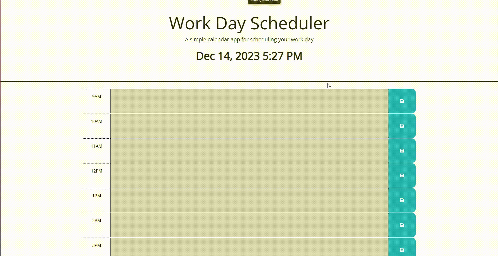

## Description

The goal of this project was to incorporate third-party APIs and JavaScript logic
to make a dynamic workload planner.

We used our upgraded DOM traversal tools and incorporated JQuery, DayJS as well as
elements from JQuesry UI. 

## User Story
AS AN employee with a busy schedule
I WANT to add important events to a daily planner
SO THAT I can manage my time effectively

## Acceptance Criteria

GIVEN I am using a daily planner to create a schedule
WHEN I open the planner
THEN the current day is displayed at the top of the calendar
WHEN I scroll down
THEN I am presented with timeblocks for standard business hours of 9am-5pm
WHEN I view the timeblocks for that day
THEN each timeblock is color coded to indicate whether it is in the past, present, or future
WHEN I click into a timeblock
THEN I can enter an event
WHEN I click the save button for that timeblock
THEN the text for that event is saved in local storage
WHEN I refresh the page
THEN the saved events persist

## Link URL to deployed webpage on GitHub
https://rafflafressia.github.io/random-password-generator/

## Capture of working program

# Installation
N/A

## Technologies Used
VS Code
Github

## Credits
Institution: The University Of Toronto
Course: Bootcamp Full Stack Development
Instructor: Daler Singh
Student Peer Help: Sahil Banati
Tutor Help: Jose Lopez
#License
NA